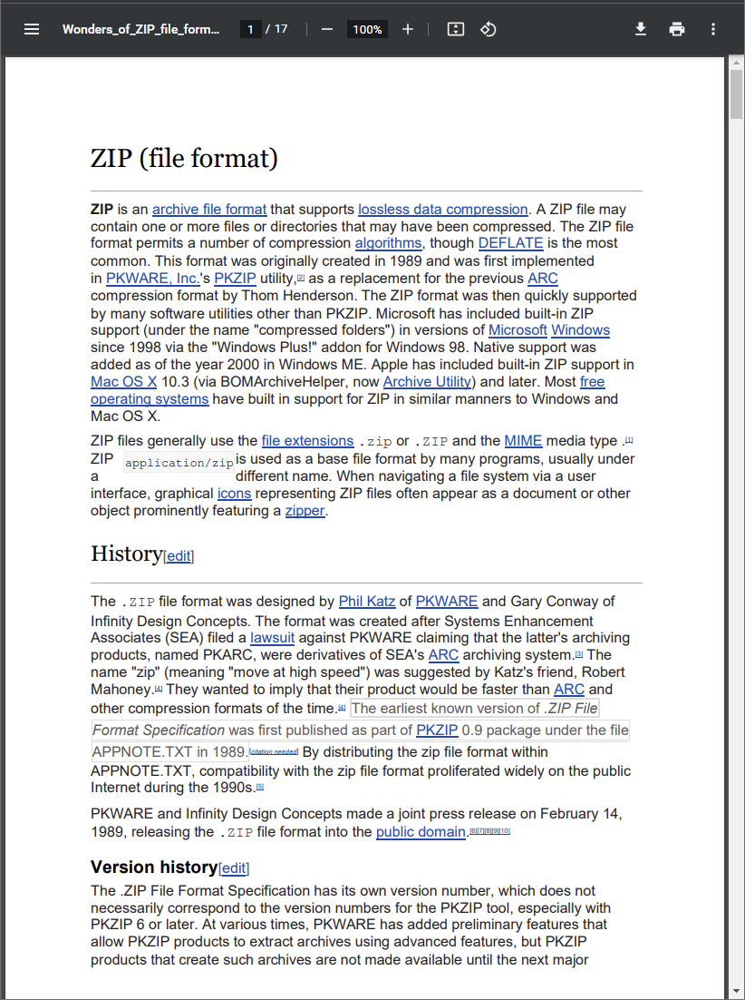
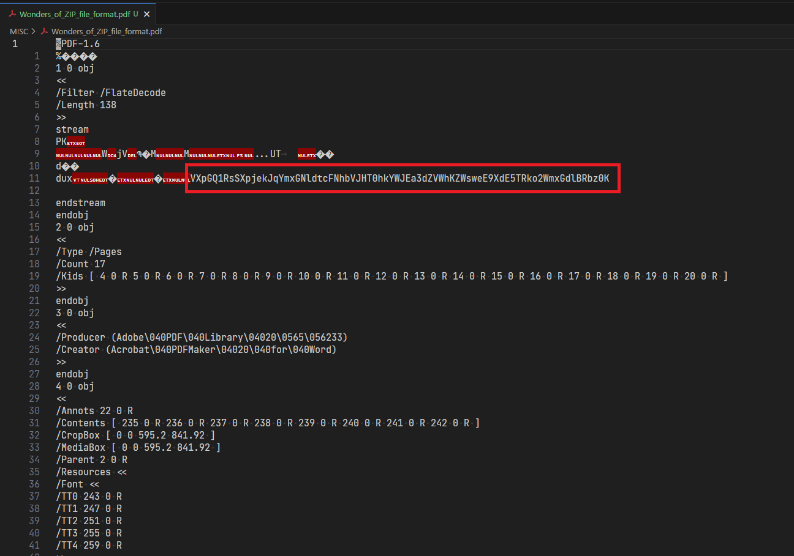

# MISC

_Na komputer klienta został dostarczony malware, ale nie wiemy w jaki sposób. Wszystko wskazuje na to, że to ten plik jest odpowiedzialny, ale nie rozumiemy jak to się stało. Może Tobie się uda?_

---

Dany jest plik **Wonders_of_ZIP_file_format.pdf**

Jest to wydruk artykułu z Wikipedii zapisany do pliku PDF. W samej treści nie ma jednak nic ciekawego.

Ciekawiej się robi dopiero gdy otworzymy plik edytorem tekstowym (np. VS Code):

Jest tam ciąg znaków `VXpGQ1RsSXpjekJqYmxGNldtcFNhbVJHT0hkYWJEa3dZVWhKZWsweE9XdE5TRko2WmxGdlBRbz0K`, który na pierwszy rzut oka wygląda jakby był zakodowany algorytmem Base64.

Do zdekodowania użyłem narzędzia [CyberChef](https://gchq.github.io/CyberChef).

Okazuje się, że ciąg był potrójnie zakodowany algorytmem Base64:

Flaga to `KPMG{4rt3f4ct_0f_thr33_d0ts}`

Na to zadanie zeszło mi trochę czasu, ponieważ większość czasu spędziłem na analizowaniu samej treści dokumentu.
