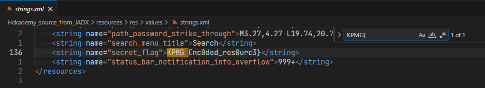

# Mobilka

_Czy potrafisz znaleźć ukryte flagi w aplikacji mobilnej?_

---

Zadanie polegało na przeprowadzeniu analizy wstecznej aplikacji mobilnej na Androida. Dany był plik ZIP zawierający aplikację spakowaną do pliku APK (który nomen omen też jest zapisany w formacie ZIP).

Aplikacja po uruchomieniu wygląda następująco:


Pierwszym krokiem było zdekompilowanie aplikacji i zdekodowanie zasobów w celu poznania kodu źródłowego (oczywiście w pewnym zakresie).
Do tego celu użyłem narzędzia `jadx` w wersji [webowej](https://www.jdoodle.com/online-java-compiler/).

## Flaga #1

Pierwsza flaga to po prostu zakodowany zasób (resource) w źródłach aplikacji.
W pliku `manifest.xml` zasugerowano wykorzystanie narzędzia `apktool` lub <_czegoś innego_>:

```xml
<meta-data android:name="hint" android:value="You need to decode resources. Try apktool online or https://bit.ly/3tn0Fh3 :)"/>
```

Jednak tutaj nie było to koniecznie, ponieważ `jadx` zdekodował wszystkie zasoby już wcześniej przy okazji dekompilacji aplikacji.

Do znalezienia flagi wystarczyło przeszukanie wszystkich plików pod kątem zawierania frazy `KPMG{`. Ta znajdowała się w pliku `strings.xml`:



Flaga #1 to `KPMG{Enc0ded_res0urc3}`

## Dekompilacja

Tutaj zaczyna się cała zabawa. Najciekawszy plik w kodzie źródłowym to oczywiście `MainActivity.java`:

```java
package com.example.hckademy;

import android.os.Bundle;
import android.util.Log;
import android.view.View;
import android.widget.EditText;
import android.widget.Toast;
import java.security.MessageDigest;
import java.security.NoSuchAlgorithmException;
import java.util.Objects;
import java.util.stream.Collectors;
import java.util.stream.IntStream;
import p010d.C0735e;
import p067x0.C1238a;

public class MainActivity extends C0735e {

    static {
        System.loadLibrary("c.");
    }

    public native boolean check2(String str, byte[] bArr);

    public void onCheck(View view) {
        byte[] bArr;
        String obj = ((EditText) findViewById(R.id.flag)).getText().toString();
        Log.d("H@ckademy - MainActivity", "onCheck: " + obj);
        byte[] bytes = obj.getBytes();
        byte[] bytes2 = getString(R.string._encryption_password).getBytes();
        for (int i = 0; i < bytes.length; i++) {
            bytes[(bytes.length - i) - 1] = (byte) (bytes[(bytes.length - i) - 1] ^ bytes2[i % bytes2.length]);
        }
        String str = (String) IntStream.range(0, bytes.length).mapToObj(new C1238a(bytes)).collect(Collectors.joining());
        Log.d("H@ckademy - MainActivity", "check1: " + str);
        if (!Objects.equals(str, "323d28231a2f0c1f31103212633d4a033a372c2a2f09174235226f36")) {
            try {
                MessageDigest instance = MessageDigest.getInstance("SHA-512");
                instance.update(obj.getBytes());
                bArr = instance.digest();
            } catch (NoSuchAlgorithmException e) {
                e.printStackTrace();
                bArr = new byte[0];
            }
            if (!check2(obj, bArr)) {
                Toast.makeText(getApplicationContext(), "Incorrect flag!", 1).show();
                Log.wtf("H@ckademy - MainActivity", "error! Incorrect flag!");
                return;
            }
        }
        Toast.makeText(getApplicationContext(), "Congratulations! You've found the flag!", 1).show();
        Log.d("H@ckademy - MainActivity", "success! Congratulations! You've found the flag!");
    }
}
```

Najistotniejsze są jednak poniższe linie:

```java
byte[] bytes = obj.getBytes();
byte[] bytes2 = getString(R.string._encryption_password).getBytes();

for (int i = 0; i < bytes.length; i++) {
    bytes[(bytes.length - i) - 1] = (byte) (bytes[(bytes.length - i) - 1] ^ bytes2[i % bytes2.length]);
}

String str = (String) IntStream.range(0, bytes.length).mapToObj(new C1238a(bytes)).collect(Collectors.joining());

if (!Objects.equals(str, "323d28231a2f0c1f31103212633d4a033a372c2a2f09174235226f36")) {
    try {
        MessageDigest instance = MessageDigest.getInstance("SHA-512");
        instance.update(obj.getBytes());
        bArr = instance.digest();
    } catch (NoSuchAlgorithmException e) {
        e.printStackTrace();
        bArr = new byte[0];
    }
    if (!check2(obj, bArr)) {
        Toast.makeText(getApplicationContext(), "Incorrect flag!", 1).show();
        return;
    }
}
Toast.makeText(getApplicationContext(), "Congratulations! You've found the flag!", 1).show();
```

Widzimy zatem, że są dwie drogi uzyskania flagi.
Wystarczy tylko tak dobrać argumenty, aby poniższe linie ewaluowały się do wartości `True`:

```java
1. Objects.equals(str, "323d28231a2f0c1f31103212633d4a033a372c2a2f09174235226f36")
// albo
2. check2(obj, bArr)
```

## Flaga #2

Przyjrzyjmy się bliżej pierwszej opcji. Uproszczony fragment kodu:

```java
byte[] bytes = obj.getBytes();
byte[] bytes2 = getString(R.string._encryption_password).getBytes();

for (int i = 0; i < bytes.length; i++) {
    bytes[(bytes.length - i) - 1] = (byte) (bytes[(bytes.length - i) - 1] ^ bytes2[i % bytes2.length]);
}

String str = (String) IntStream.range(0, bytes.length).mapToObj(new C1238a(bytes)).collect(Collectors.joining());

if (!Objects.equals(str, "323d28231a2f0c1f31103212633d4a033a372c2a2f09174235226f36")) {
    return;
}
Toast.makeText(getApplicationContext(), "Congratulations! You've found the flag!", 1).show();
```

Tablica `bytes` to dane wprowadzane do pola tekstowego, a `bytes2` to znany zahardkodowany klucz XOR. Jest on zdefiniowany w pliku `strings.xml`:

```xml
    <string name="_encryption_password">@string/app_name</string>
    <string name="app_name">KPMG H@ckademy</string>
```

W pętli wykonywana jest operacja XOR poszczególnych znaków flagi `bytes` z kluczem `bytes2` (o wartości `"KPMG H@ckademy"`):

```java
for (int i = 0; i < bytes.length; i++) {
    bytes[(bytes.length - i) - 1] = (byte) (bytes[(bytes.length - i) - 1] ^ bytes2[i % bytes2.length]);
}
```

Znamy również długość wyjściowego szyfrogramu `323d28231a2f0c1f31103212633d4a033a372c2a2f09174235226f36`.
Składa się on z 56 cyfr hexadecymalnych, co przekłada się na flagę o długości 28 znaków ASCII (znaki ASCII koduje się na 2 bajtach).
Zupełnie _przypadkowo_ dokładnie 2 razy więcej niż długość klucza XOR :smile:
Wykonanie pętli wygląda zatem następująco:

```java
bytes[27] = bytes[27] ^ bytes2[0]
          |
bytes[14] = bytes[14] ^ bytes2[13]
bytes[13] = bytes[13] ^ bytes2[0]
          |
bytes[0]  = bytes[0]  ^ bytes2[13]
```

Widzimy, że poszczególne znaki są XORowane niezależnie od siebie (brak sprzężenia zwrotnego).

Operacja XOR ma następujące własności:

- jest przemienna: A ^ B = B ^ A
- jest łączna: (A ^ B) ^ C = A ^ (B ^ C)
- posiada element neutralny, tj. 0: A ^ 0 = A
- posiada element odwrotny, tj. ten sam element: A ^ A = 0

Zatem XOR możemy odwrócić w następujący sposób:

```
A ^ B = C
A ^ B = C ^ 0
A ^ B = C ^ B ^ B
A = C ^ B
```

Wystarczy jedynie zamienić miejscami szyfrogram z flagą i jeszcze raz wykonać pętlę szyfrującą.
Pozostaje tylko kwestia w jaki sposób w Javie zamienić string cyfr hexadecymalnych na tablicę bajtów.
Tu z pomocą przychodzi [Stack Overflow](https://stackoverflow.com/questions/8890174/in-java-how-do-i-convert-a-hex-string-to-a-byte) i podpowiada, aby użyć klasy `BigInteger` (o przepełnienie zakresu [nie trzeba się martwić](https://stackoverflow.com/questions/12693273/is-there-an-upper-bound-to-biginteger)).

Ostatecznie flagę da poniższy program:

```java
import java.math.BigInteger;
import java.nio.charset.StandardCharsets;

public class Decryptor {
    public static void main(String args[]) {
        byte[] bytes = new BigInteger("323d28231a2f0c1f31103212633d4a033a372c2a2f09174235226f36", 16).toByteArray();
        byte[] bytes2 = new String ("KPMG H@ckademy").getBytes();

        for (int i = 0; i < bytes.length; i++) {
            bytes[(bytes.length - i) - 1] = (byte) (bytes[(bytes.length - i) - 1] ^ bytes2[i % bytes2.length]);
        }

        String flag = new String(bytes, StandardCharsets.UTF_8);
        System.out.println("Flag: " + flag);
    }
}
```

Flaga #2 to `KPMG{Do_y0u_3v3n_SMALI_bro?}`

Po uruchomieniu aplikacji i podaniu flagi mamy potwierdzenie, że jest poprawna:


Takie "szyfrowanie" to idealny przykład (celowego) błędu klasy _Cryptographic Failures_ z zestawienia [OWASP TOP 10](https://owasp.org/Top10/A02_2021-Cryptographic_Failures/).

## Flaga #3

Trzeciej flagi nie byłem w stanie ustalić, pomimo długich poszukiwań i wielu prób.

Próbowałem _zreversować_ funkcję `check2`. Uproszczony fragment kodu aplikacji:

```java
public class MainActivity {

    static {
        System.loadLibrary("c.");
    }

    public native boolean check2(String str, byte[] bArr);

    public void onCheck(View view) {
        byte[] bArr;
        String obj = ((EditText) findViewById(R.id.flag)).getText().toString();

        try {
            MessageDigest instance = MessageDigest.getInstance("SHA-512");
            instance.update(obj.getBytes());
            bArr = instance.digest();
        } catch (NoSuchAlgorithmException e) {
            e.printStackTrace();
            bArr = new byte[0];
        }
        if (!check2(obj, bArr)) {
            Toast.makeText(getApplicationContext(), "Incorrect flag!", 1).show();
            return;
        }
        Toast.makeText(getApplicationContext(), "Congratulations! You've found the flag!", 1).show();
    }
}
```

Deklaracja funkcji `check2` wygląda następująco:

```java
native boolean check2(String str, byte[] bArr);
```

Widzimy też, że ładowana jest biblioteka o nazwie `c.`.
Do dynamicznie dołączanych bibliotek Java automatycznie dodaje przedrostek `lib` oraz rozszerzenie `.so`, wychodzi zatem `libc..so`, a taki właśnie plik znajduje się w źródłach.
Biblioteka jest bardzo sprytnie ukryta, ponieważ podwójna kropka jest słabo widoczna.


Jest to natywna biblioteka języka C++ dynamicznie dołączana do aplikacji w Javie (więcej [tutaj](https://developer.android.com/ndk/guides/cpp-support)).

Do zdekompilowania biblioteki najlepiej sprawdził się dekompilator [HEX rays](https://dogbolt.org/?id=ce174aa7-76be-4362-9d56-c5118ac33728#Hex-Rays=77).
Pomocny był także program [Cutter](https://cutter.re/).


Jak widać powyżej, biblioteka zawiera implementację funkcji `check2` (wykorzystując **Java Native Interface**).

Po żmudnym procesie dekompilacji udało mi się ustalić, że kluczowy fragment przypuszczalnego kodu źródłowego funkcji `check2` mógł wyglądać mniej-więcej tak (pseudo kod a'la język C):

```c
typedef unsigned char BYTE;

if (FlagLength == 41)
{
    srand(0);
    srand(rand());

    BYTE v1 = Digest[rand() % DigestLength];
    BYTE v2 = Digest[rand() % DigestLength] * v1;
    BYTE v3 = Digest[rand() % DigestLength];
    BYTE v4 = v3 % Digest[rand() % DigestLength] + v2;
    BYTE v5 = Digest[rand() % DigestLength];
    BYTE v6 = Digest[rand() % DigestLength];

    srand(v4 - v5 / v6);

    xor_key[0] = (BYTE)(Digest + rand() % DigestLength);
    xor_key[1] = (BYTE)(Digest + rand() % DigestLength);
    xor_key[2] = (BYTE)(Digest + rand() % DigestLength);
    xor_key[3] = (BYTE)(Digest + rand() % DigestLength);
    xor_key[4] = (BYTE)(Digest + rand() % DigestLength);

    BYTE arr[128];

    for (int i = 0; i < 41; i++)
    {
        arr[i] = Flag[i * 2];
    }

    arr = xors(arr, 41, xor_key, 5);
    return equals(arr, flag, 41) & 1;
}
```

I tutaj ściana.
Generator liczb pseudolosowych zainicjalizowany został znaną wartością, więc jesteśmy w stanie odtworzyć wszystkie kolejne wywołania funkcji `rand`.
Odwrócenie funkcji `xors` również jest trywialne (o ile znamy klucz, a tutaj byłby znany).
Problem robi się jednak przy odczytywaniu tablicy `Digest`. Skoro jest ona skrótem flagi - a jej nie znamy - to nie możemy wyliczyć również skrótu.
I chociaż, znamy początek `KPMG{` i koniec flagi `}` (razem 6 znaków), to pozostaje jeszcze 35.
Metodą siłową (_brute-force_) nie do złamania.
Obecnie funkcja SHA-512 jest nieodwracalna.

Prawdopodobnie jest tutaj jakiś inny błąd w implementacji, ale ja nie byłem w stanie go zlokalizować, przynajmniej na razie.
Tyle, ile mogłem, to zrobiłem.
Bite kilka(naście) godzin rzeźbienia, ale było warto.
