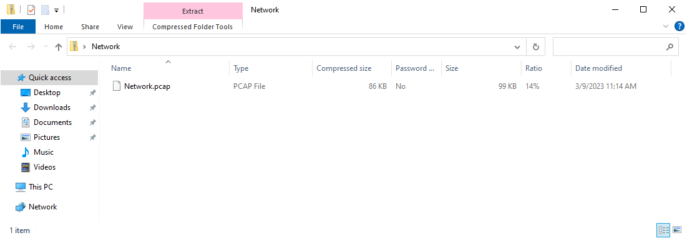
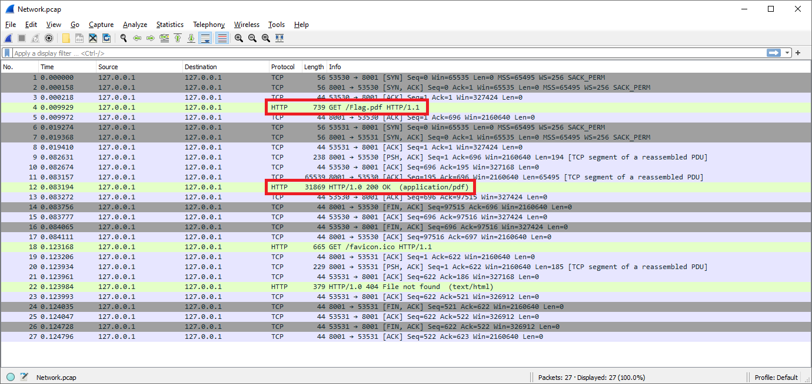
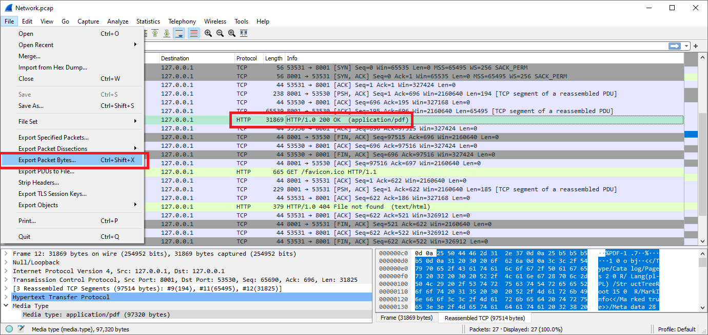
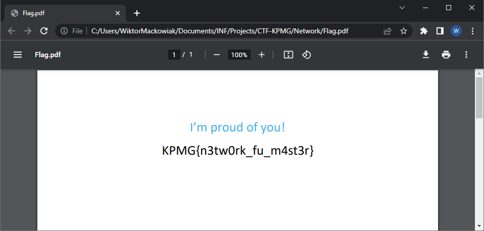

# Network

_Czy potrafisz znaleźć co było przesłane w tym ruchu sieciowym?_

---

Dany jest plik **Network.zip**, zawierający plik **Network.pcap**.

W plikach **.pcap** zapisuje się pakiety sieciowe.
Można je otworzyć np. za pomocą programu [Wireshark](https://www.wireshark.org/).

Jak widać powyżej, zarejestrowano ruch sieciowy, w którym ustanawiane jest połączenie TCP, a następnie, za pomocą protokołu HTTP, pobierany jest plik **Flag.pdf**.

Eksportujemy dane z pakietu i zapisujemy jako **Flag.pdf**:

Po otwarciu zapisanego pliku uzyskaliśmy flagę:

Flaga to `KPMG{n3tw0rk_fu_m4st3r}`
