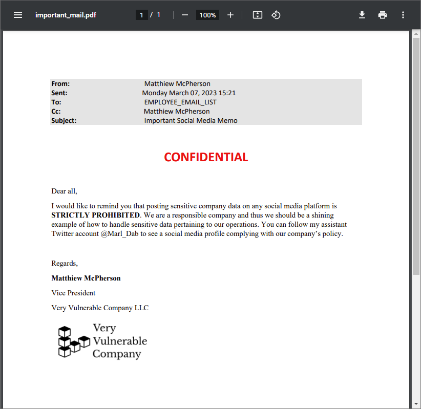
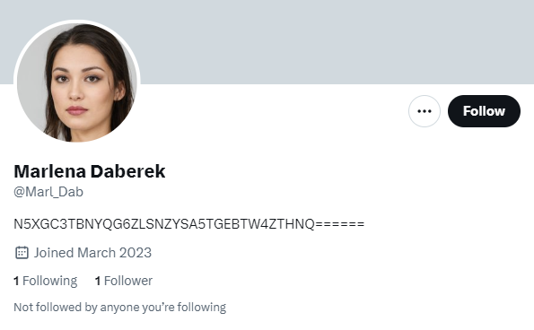
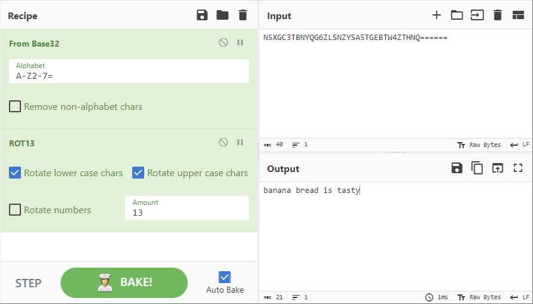
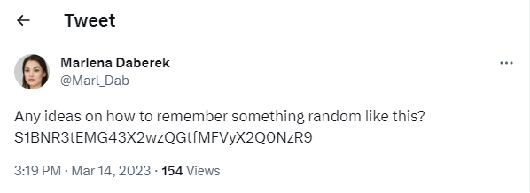
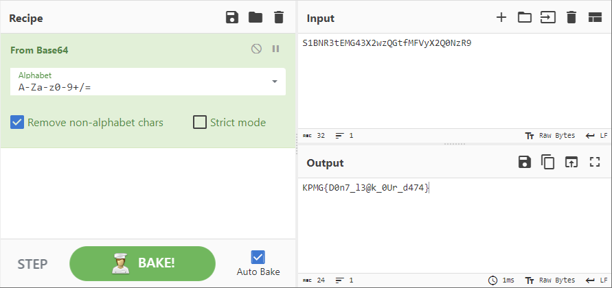
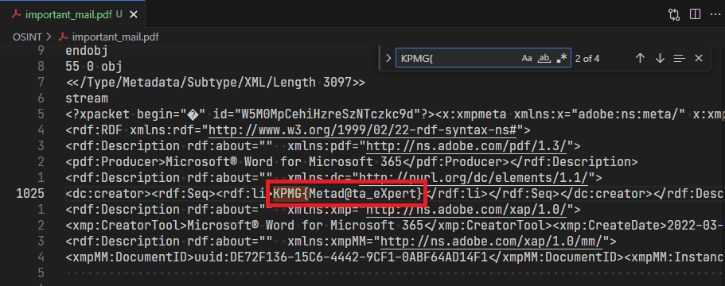
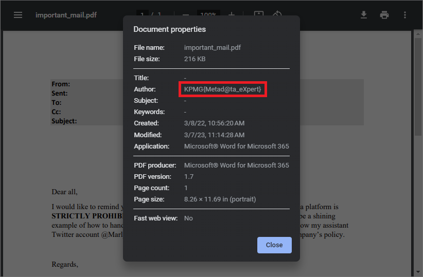

# OSINT

_Udało nam się przechwycić dokument. Podejrzewamy, że może on zawierać ciekawe informacje. Czy możesz to sprawdzić?_

---

W tym zadaniu należało znaleźć dwie flagi.
Dostaliśmy plik **important_mail.pdf**:

## Flaga #1 - Twitter

Po wejściu na profil [@Marl_Dab](https://twitter.com/Marl_Dab) na Twitterze znajdujemy ciąg znaków `N5XGC3TBNYQG6ZLSNZYSA5TGEBTW4ZTHNQ======`.

Ciąg wygląda jakby był zakodowany algorytmem Base32 (Base64 nie, ponieważ nie zawiera małych liter[^*]).
Do jego zdekodowania można wykorzystać narzędzie [CyberChef](https://gchq.github.io/CyberChef).
Po odkodowaniu algorytmem Base32 mamy ciąg `onanan oernq vf gnfgl`, który jednak nie nic nie znaczy.
[^*]: Jest to daleko idące uproszczenie tego konkretnego przypadku. Oczywiście można stworzyć taki ciąg, który zakodowany algorytmem Base64 nie będzie zawierać żadnych małych liter.

Okazuje się, że ciąg był zakodowany algorytmem Base32 oraz ROT13 (szyfr przesuwający):

Jednak wyrażenie `banana bread is tasty` to nie to czego szukamy.
Trzeba szukać dalej.

---

Na koncie znajduje się jeszcze taki tweet zawierający _niby przypadkowy_ ciąg `S1BNR3tEMG43X2wzQGtfMFVyX2Q0NzR9`:

Ciąg był zakodowany przy użyciu jedynie algorytmu `Base64`:

Flaga #1 to `KPMG{D0n7_l3@k_0Ur_d474}`

## Flaga #2 - Metadane

Druga flaga ukryta była w metadanych pliku pdf. Trzeba było podejrzeć plik edytorem tekstowym (np. VS Code) i wyszukać ciąg `KPMG{`.

Choć można było też prościej - po prostu podglądając szczegóły dokumentu w przeglądarce:

Flaga #2 to `KPMG{Metad@ta_eXpert}`
