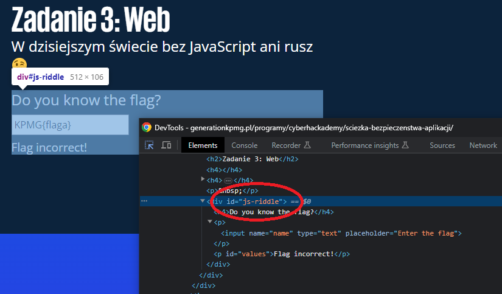

# Web

_W dzisiejszym świecie bez JavaScript ani rusz 😉_

---

Na stronie z [zadaniem](https://generationkpmg.pl/programy/cyberhackademy/sciezka-bezpieczenstwa-aplikacji/) (backup w repozytorium) ukryta jest flaga.

Mamy tu proste pole tekstowe do sprawdzania czy flaga jest poprawna:


Szybki rzut oka na zakładkę Network pozwala stwierdzić, że weryfikacja następuje lokalnie w przeglądarce - flaga nie jest sprawdzana na serwerze.
Zatem wystarczy znaleźć plik w źródłach strony, który odpowiedzialny jest za wyświetlanie frazy **Flag incorrect!**.
Szybkie przeszukanie wszystkich źródeł strony skrótem `Ctrl+Shift+F` i jest.

Inna opcja to inspekcja pola tekstowego i odnalezienie miejsca w kodzie, gdzie śledzona są zmiany wartości w polu:



_Riddle_ to po angielsku zagadka.

Obie drogi prowadzą w to samo miejsce - do pliku **riddle.js?ver=6.2.2**, schowanego wśród innych bibliotek. Wygląda on następująco:

```javascript
const riddle = document.querySelector("#js-riddle");
if (riddle) {
  const input = riddle.querySelector("input");
  const log = riddle.querySelector("#values");
  const encodedStr1 = "S1BNR3tKU18xc19mVW5f";
  const encodedStr2 = "X3IxZ0h0P30=";

  // function Random(seed) {
  //     return seed * 134 % 420;
  // }

  function Random(seed) {
    value = (seed * 134) % 420;

    return value;
  }

  input.addEventListener("input", updateValue);

  function updateValue(e) {
    var str = e.target.value;
    if (
      str == atob(encodedStr1).concat(Random(4).toString(), atob(encodedStr2))
    ) {
      log.textContent = "Flag correct!";
    } else {
      log.textContent = "Flag incorrect!";
    }
  }
}
```

Zakodowane w zmiennych `encodedStr1` i `encodedStr2` części flagi tworzą jedynie flagopodobny ciąg `KPMG{JS_1s_fUn__r1gHt?}`.
Dlatego konieczna jest własna definicja funkcji `Random`. Nomen omen deterministycznej.

Aby otrzymać flagę, wystarczy wrzucić poniższy fragment kodu do interpretera języka JavaScript:

```javascript
const encodedStr1 = "S1BNR3tKU18xc19mVW5f";
const encodedStr2 = "X3IxZ0h0P30=";

function Random(seed) {
  value = (seed * 134) % 420;
  return value;
}

const flag = atob(encodedStr1).concat(Random(4).toString(), atob(encodedStr2));
console.log(flag);
```

Flaga to `KPMG{JS_1s_fUn_116_r1gHt?}`
